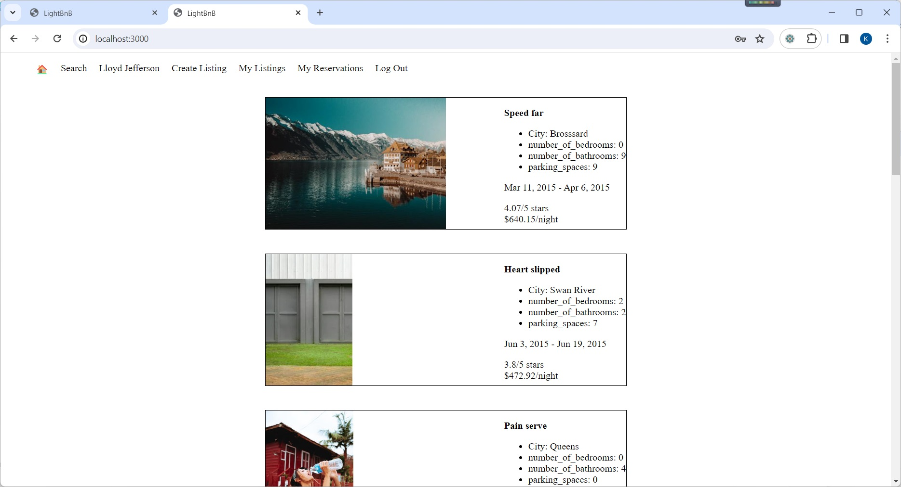

# LightBnB
By Wing Koon, Kevin Leung

Lighthouse BnB is a revolutionary new app that will allow homeowners to rent out their homes to people on vacation. It is an "AirBNB" clone that uses server-side javascript to query a database via SQL. Users can view property information, book reservations, view their reservations, and write reviews. It is built using Node.js, Express.js, and PostgreSQL on the backend, and HTML, CSS, and JavaScript on the frontend.

## Project Structure

.
├── db
│   ├── json
│   └── database.js
├── public
│   ├── javascript
│   │   ├── components 
│   │   │   ├── header.js
│   │   │   ├── login_form.js
│   │   │   ├── new_property_form.js
│   │   │   ├── property_listing.js
│   │   │   ├── property_listings.js
│   │   │   ├── search_form.js
│   │   │   └── signup_form.js
│   │   ├── libraries
│   │   ├── index.js
│   │   ├── network.js
│   │   └── views_manager.js
│   ├── styles
│   │   ├── main.css
│   │   └── main.css.map
│   └── index.html
├── routes
│   ├── apiRoutes.js
│   └── userRoutes.js
├── styles  
│   ├── _forms.scss
│   ├── _header.scss
│   ├── _property-listings.scss
│   └── main.scss
├── .gitignore
├── package-lock.json
├── package.json
├── README.md
└── server.js

* `db` contains all the database interaction code.
  * `json` is a directory that contains a bunch of dummy data in `.json` files.
  * `database.js` is responsible for all queries to the database. It doesn't currently connect to any database, all it does is return data from `.json` files.
* `public` contains all of the HTML, CSS, and client side JavaScript. 
  * `index.html` is the entry point to the application. It's the only html page because this is a single page application.
  * `javascript` contains all of the client side javascript files.
    * `index.js` starts up the application by rendering the listings.
    * `network.js` manages all ajax requests to the server.
    * `views_manager.js` manages which components appear on screen.
    * `components` contains all of the individual html components. They are all created using jQuery.
* `routes` contains the router files which are responsible for any HTTP requests to `/users/something` or `/api/something`. 
* `styles` contains all of the sass files. 
* `server.js` is the entry point to the application. This connects the routes to the database.

## Technologies Used
- HTML5
- CSS3 (with a focus on Flexbox and Media Queries for responsive design)
- JavaScript (jQuery)
- AJAX for asynchronous data handling
- Node.js and Express (for backend server functionality)
- REACT for frontend implementation
- SQL for database and querry

## Dependencies

- Express
- Node.js
- Body-parser
- Postgres
- Bcrypt
- Cookie session
- Nodemon

## Getting Started

1. Download the software.

https://github.com/wingkoon/lightbnb.git

2. Prepare for the dependency.

- Go to the directory /lightbnb
- Install all dependencies (using the `npm install` command).
i.e.,       
    npm install

3. Start the postgres
    startpostgres

4. Run your node server.

- Run the development web server using the `npm start` command.

5. Browse to `http://localhost:3000/`

 In web browser, go to http://localhost:3000/ to access 

- Enjoy all its features

## Features

### ERD Diagram

### Browse Home Page

- Users can browse through property listngs that have been submitted by other users.

### Sign up Page

### Login Page

### Search Page

- Users can search through property listings based on specific search criteria such as city, price range and rating.

### Create Listing

The form on the frontend will insert a new entry into to properties table

### My Listing Page

- Display the listing w.r.t. the specific owner_id.

### My Reservation Page

- Display the reservation w.r.t. the specific owner_id.

All example users in the database used have a password of `password` to make it easy to test.
